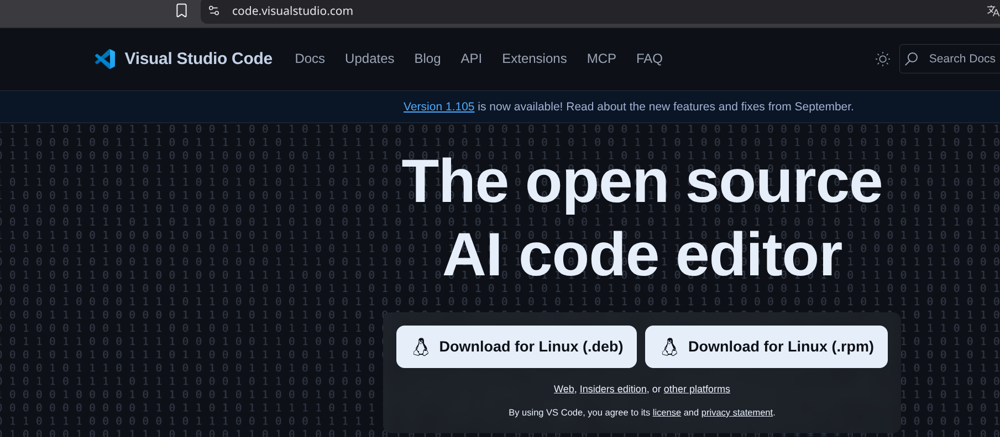
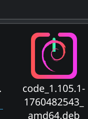
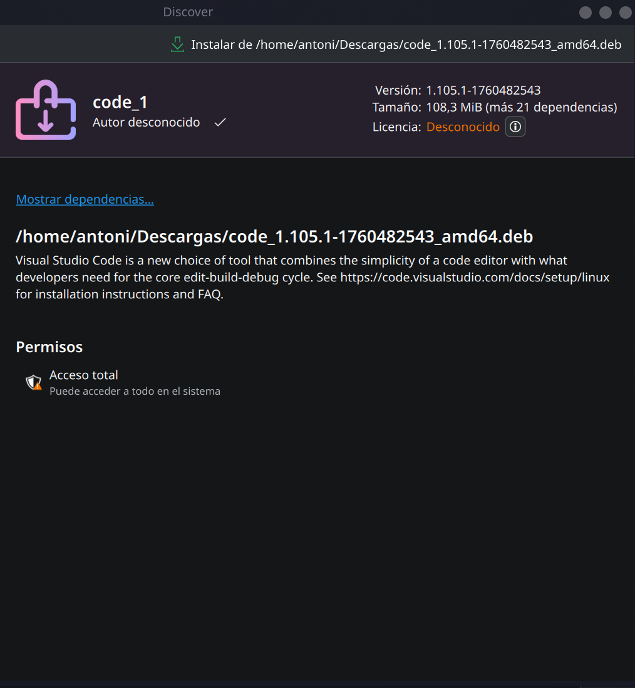
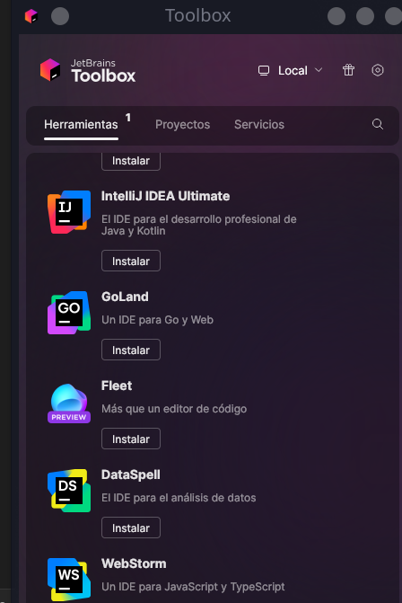
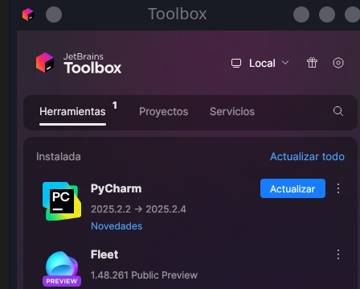

0
## IDEs utilizados

- **IDE 1:** Visual Studio Code (versión más reciente 1.105)
    
- **IDE 2:** JetBrains Fleet (versión beta, 1.45)
    

## Descripción de la tarea

Instalación de dos entornos de desarrollo (VSCode y Fleet) en Linux Debian, capturando el proceso completo de instalación para comparar las diferencias entre un IDE de código abierto (VSCode) y uno propietario (Fleet).

## Respuestas a preguntas evaluativas

### Pregunta 1: ¿Qué diferencias encontraste en el proceso de instalación entre el IDE propietario y el libre?

- **VSCode (libre):** Proceso directo mediante descarga del archivo .deb desde el sitio web oficial e instalación a través del gestor de paquetes del sistema.
    
- **Fleet (propietario):** Depende del ecosistema JetBrains. Si ya se tiene Toolbox instalada, el proceso es muy simple. De lo contrario, requiere instalar primero Toolbox y luego Fleet.
    

### Pregunta 2: ¿Qué ventajas identificaste en cada uno de los entornos durante la instalación?

- **VSCode:** Instalación independiente y rápida, sin dependencias de otros productos.
    
- **Fleet:** Integración perfecta con el ecosistema JetBrains si ya se usan otros IDEs de la compañía.
    

## Evidencias

## Observaciones

Ambos procesos son simples, pero VSCode es más directo para usuarios nuevos, mientras que Fleet es más conveniente para quienes ya usan productos JetBrains.
