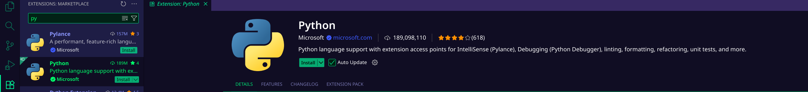
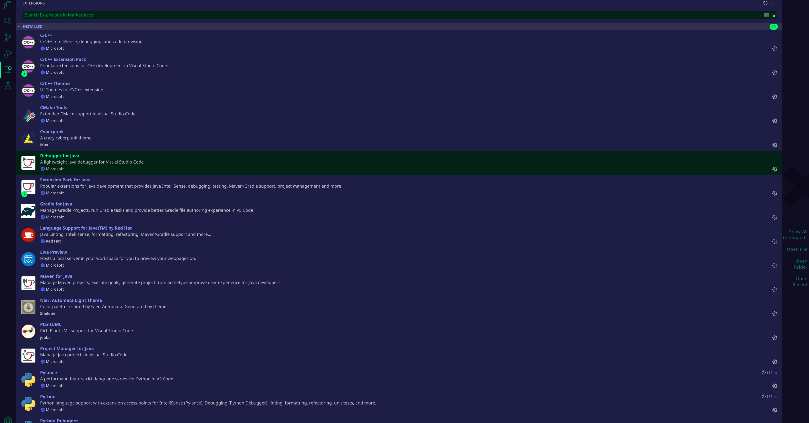
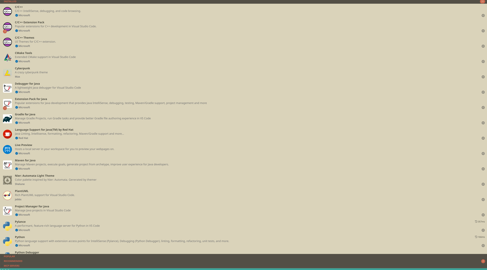
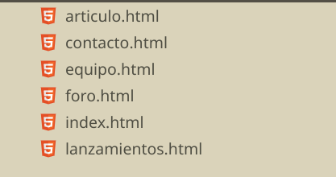
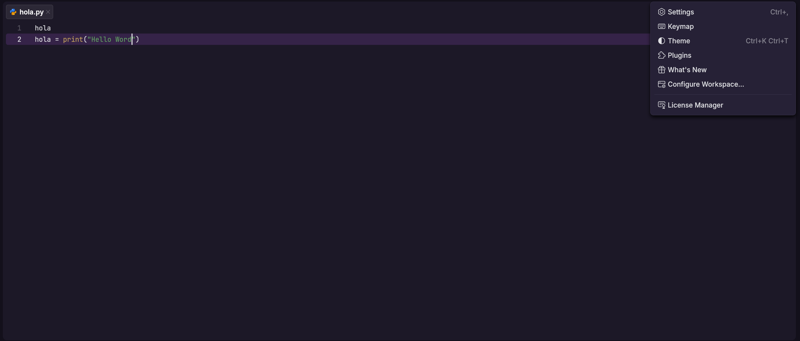
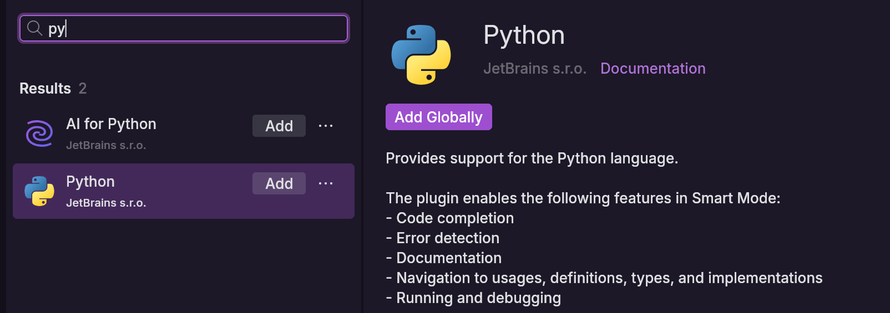
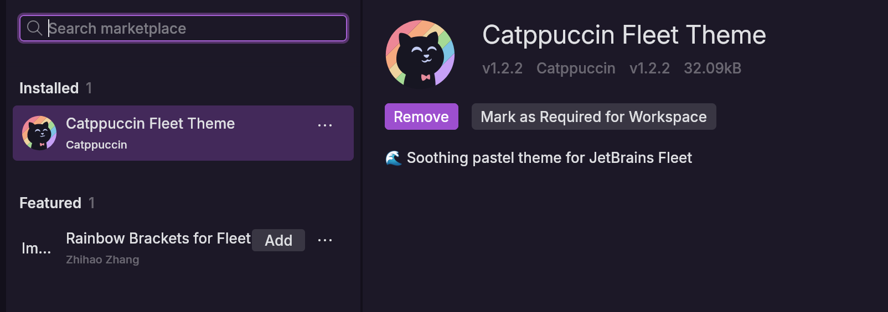
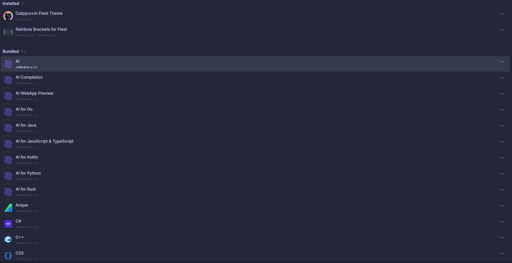

## IDEs utilizados

- **IDE 1:** Visual Studio Code (versión más reciente, 1.105)
    
- **IDE 2:** JetBrains Fleet (versión beta,1.45)
    

## Descripción de la tarea

Instalación de extensiones/plugins en ambos IDEs para ampliar su funcionalidad, específicamente para trabajar con Python y personalizar la apariencia.

## Respuestas a preguntas evaluativas

### Pregunta 1: ¿Cómo fue el proceso de instalación de extensiones o módulos en cada IDE?

- **VSCode:** Acceso directo mediante el icono de extensiones en la barra lateral, búsqueda e instalación con un clic.
    
- **Fleet:** Menú Configuración > Plugins, búsqueda y botón "Add" para instalar.
    

### Pregunta 2: ¿Qué beneficios proporcionan las extensiones o plugins que instalaste para el desarrollo de tus proyectos?

- **VSCode:** Extensiones para Java, C/C++ y Python permiten desarrollo nativo con debugger y ejecución. Temas visuales y VSCode-icons mejoran la experiencia visual. PlantUML y Live Preview añaden funcionalidades específicas útiles.
    
- **Fleet:** Extensión de Python habilita ejecución y debugging. Temas personalizables y Rainbow Brackets mejoran la legibilidad del código.
    

## Evidencias

## Observaciones

VSCode tiene un ecosistema de extensiones mucho más maduro y diverso, mientras que Fleet aún tiene pocos plugins de terceros disponibles.
