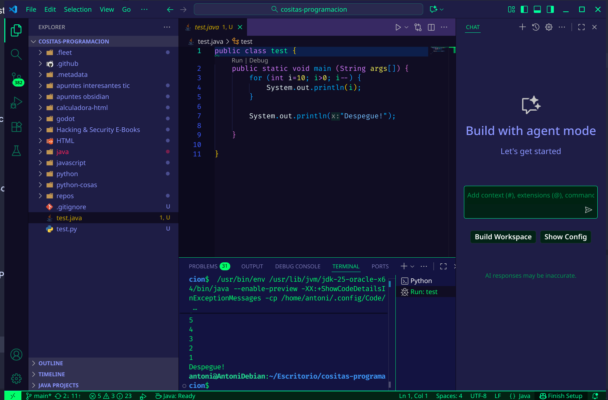
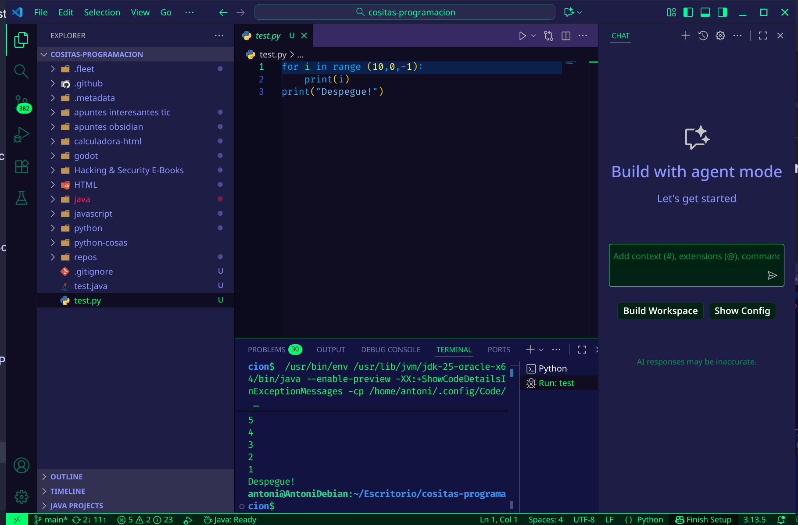
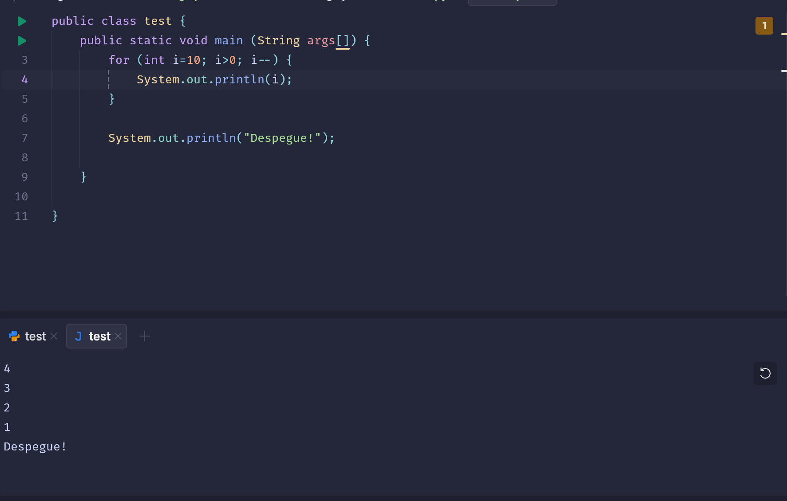
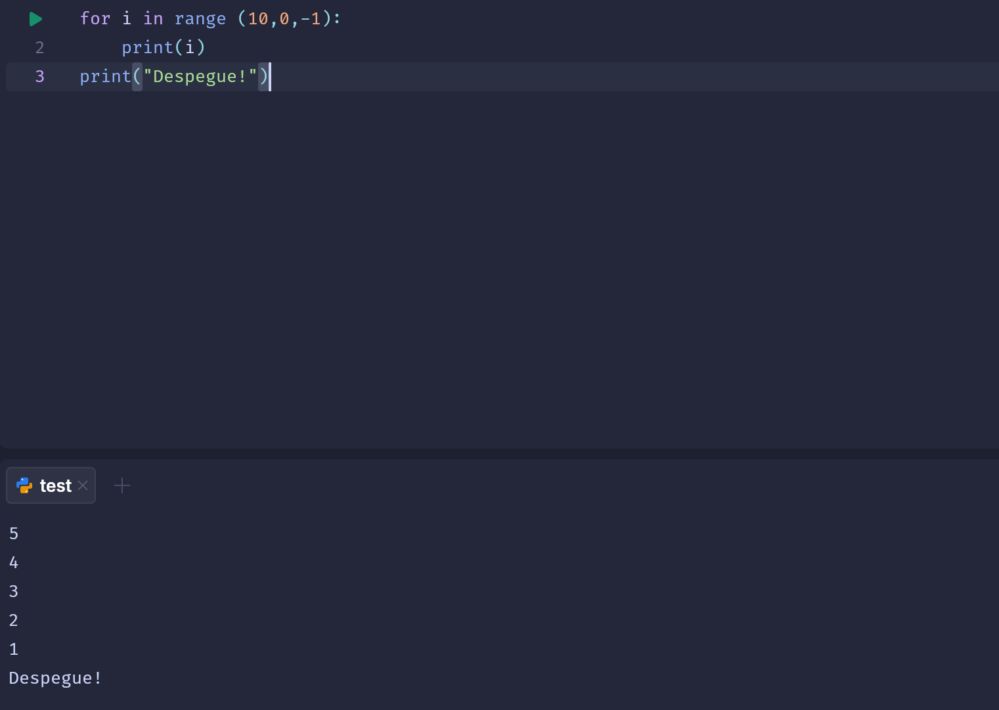

## IDEs utilizados

- **IDE 1:** Visual Studio Code (versión más reciente, 1.105)
    
- **IDE 2:** JetBrains Fleet (versión beta, 1.45)
    

## Descripción de la tarea

Creación y ejecución de un programa que cuenta de 10 a 0 y muestra "¡Despegue!" en dos lenguajes diferentes (Java y Python) dentro del mismo IDE.

## Respuestas a preguntas evaluativas

### Pregunta 1: ¿Cuál fue el proceso para ejecutar el mismo programa en diferentes lenguajes dentro del mismo IDE?

- Ambos IDEs requieren extensiones/plugins específicos para cada lenguaje
    
- VSCode necesita instalar extensiones manualmente para tanto para Java como para Python
    
- Fleet viene con soporte preinstalado para múltiples lenguajes
    

### Pregunta 2: ¿Qué diferencias encontraste en la generación del ejecutable entre los dos lenguajes?

- **Python:** Ejecución interpretada directa
    
- **Java:** Requiere compilación previa a bytecode antes de ejecución
    
- Fleet presenta una interfaz diferente al ejecutar, mostrando una barra para seleccionar el programa a ejecutar
    

## Evidencias

## Observaciones

Ambos IDEs dependen de extensiones para la ejecución de código, siendo el proceso similar en ambos casos una vez configurado el soporte para cada lenguaje.