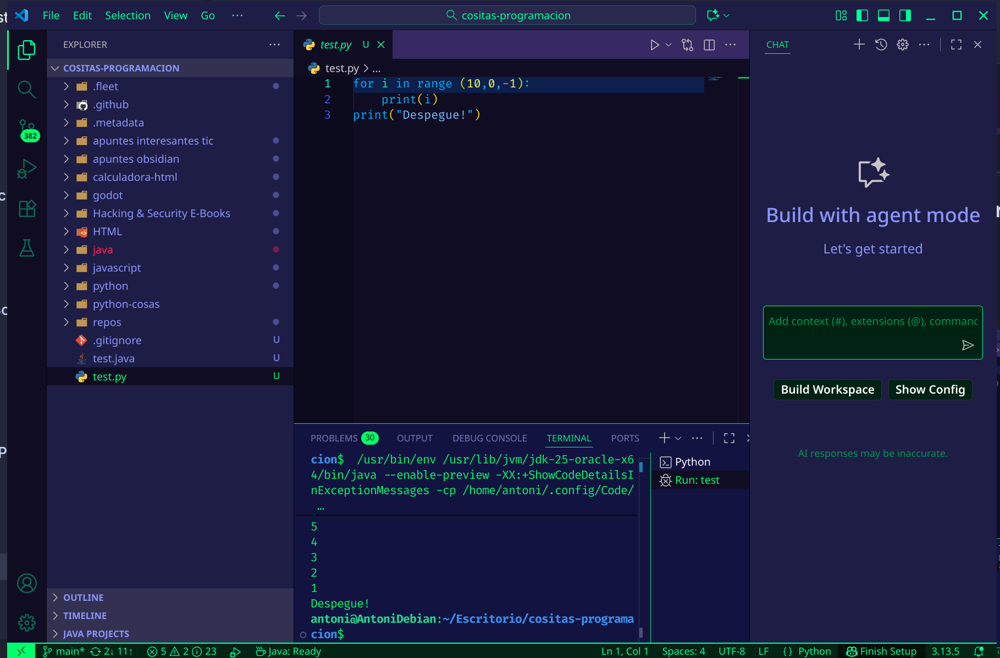

## IDEs utilizados

- **IDE 1:** Visual Studio Code (versión más reciente)
    
- **IDE 2:** JetBrains Fleet (versión beta)
    

## Descripción de la tarea

Ejecución del mismo programa Python (cuenta regresiva de 10 a 0 con mensaje "¡Despegue!") en ambos IDEs para comparar la experiencia.

## Respuestas a preguntas evaluativas

### Pregunta 1: ¿Qué diferencias encontraste al ejecutar el mismo código fuente en diferentes IDEs?

- **VSCode:** Ejecución directa con el botón "Run"
    
- **Fleet:** Al presionar "Run" aparece una barra para seleccionar qué programa ejecutar
    
- Ambos producen el mismo resultado funcional
    

### Pregunta 2: ¿Cuál de los IDEs te pareció más cómodo o eficiente para ejecutar el código Python? ¿Por qué?

**VSCode** es actualmente más completo y eficiente porque:

- Tiene un ecosistema de extensiones más maduro
    
- Proceso de ejecución más directo
    
- Mayor personalización y automatización
    
- Fleet, aunque más fluido visualmente, está aún en desarrollo y le faltan características importantes
    

## Evidencias

## Observaciones

Aunque ambos IDEs ejecutan correctamente el código Python, VSCode ofrece una experiencia más pulida y completa, mientras que Fleet muestra indicios de ser un producto aún en desarrollo beta. 