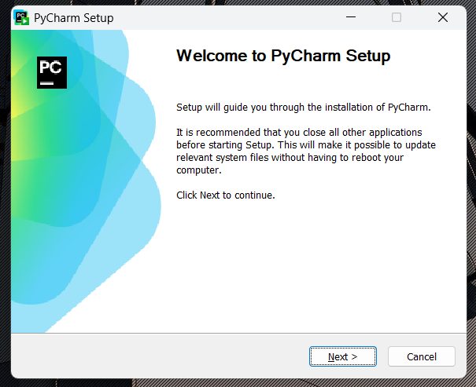

# Punto 1: Instalación de entornos de desarrollo, propietarios y libres

## IDEs utilizados
- **IDE 1:** Pycharm - Versión 21.0.8
- **IDE 2:** Visual Studio Code - Versión 1.105.

## Descripción de la tarea
[Explica el proceso de instalación de ambos IDEs, sistema operativo utilizado, etc.]
El sistema operativo utilizado fue Windows 11.
- **Proceso de Pycharm**= Se accedió al sitio oficial de jetbrains iniciando sesión y se descargó la versión PyCharm Professional. Se ejecutó el instalador y se siguieron los pasos del asistente de instalacion.
- **Proceso de Visual Studio Code**= Se ingresó al sitio oficial de Visual Studio Code y se descargó. Se ejecutó el instalador y se siguieron los pasos.

## Respuestas a preguntas evaluativas

### Pregunta 1: ¿Qué diferencias encontraste en el proceso de instalación entre el IDE propietario y el libre?
- La diferencia principal que se nota es el tamaño y la duración de la instalación, En Visual su descarga pesa una media de 200MB y el espacio requerido en disco es 434,3 MB mientras que Pycharm su descarga es 1.2 GB y el espacio requerido en disco es 3.4GB lo que hace que tarde más en instalarse.
- La instalación de Pycharm es más guiada y lenta mientras que la de Visual Studio Code es más rapida y sencilla
- Pycharm descarga un IDE con todas las herramientas integrada mientras que Visual Studio Code necesita instalar extensiones para serlo.

### Pregunta 2: ¿Qué ventajas identificaste en cada uno de los entornos durante la instalación?
- La ventaja más grande la tiene pycharm, como está especializado en Python, al instalarlo ya incluye todas las herramientas para empezar a programar en Python, mientras que en Visual Studio Code tendrias que instalar todas las extensiones.

## Evidencias

