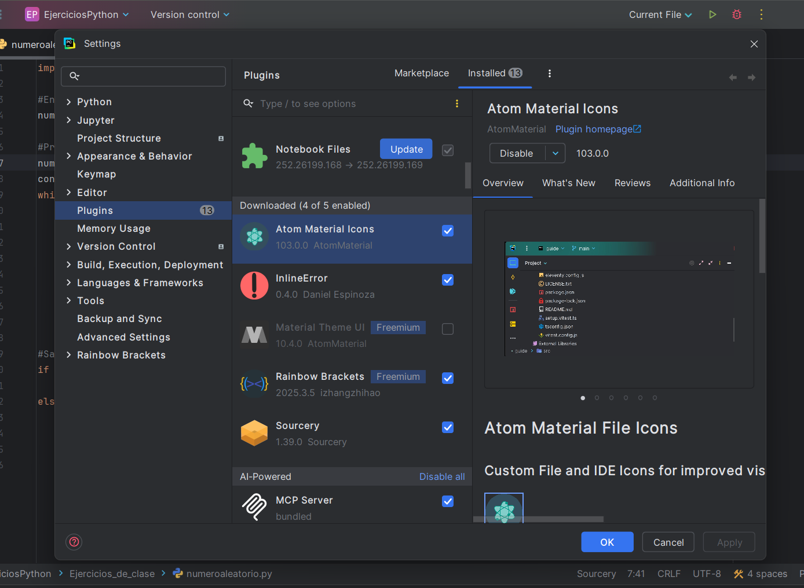
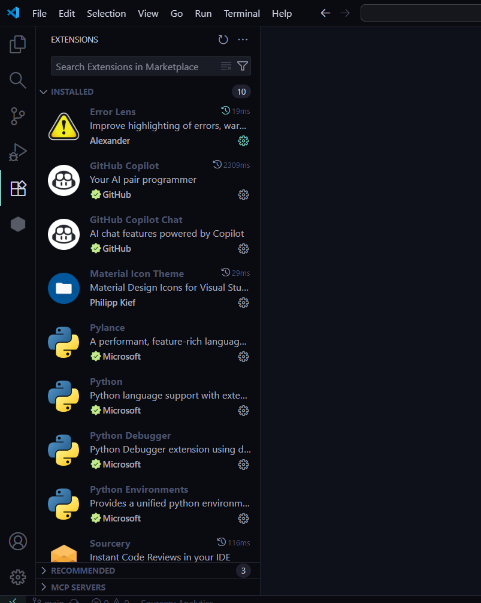

# Punto 2: Gestión de módulos y extensiones en el entorno de desarrollo

## IDEs utilizados
- **IDE 1:** Pycharm - Versión 21.0.8
- **IDE 2:** Visual Studio Code - Versión 1.105.1

## Descripción de la tarea
En esta tarea me centré en buscar algunas extensiones utiles y otras para mejorar la visibilidad y aspecto del IDE.
- En VSCode: Github Copilot, Material Icon Theme, Vira Theme y ErrorLens.
- En Pycharm: Atom Material Icon, Material Theme UI y InlineError.
- Ambos: Rainbow brackets y Sourcery.

## Respuestas a preguntas evaluativas

### Pregunta 1: ¿Cómo fue el proceso de instalación de extensiones o módulos en cada IDE?
En ambos IDEs el proceso de instalación de extensiones es facil y rapido. La diferencia principal es que en Visual Studio Code se encuentran en un panel lateral llamado "Extensions" mientras que en Pycharm se accede a través de Settings y luego Plugins.

### Pregunta 2: ¿Qué beneficios proporcionan las extensiones o plugins que instalaste para el desarrollo de tus proyectos?
**Github Copilot**: Es un Asistente IA que te ayuda a programar más rapido. Lo más importante de este asistente es que puede comprender el contexto de tu codigo y a partir de ahi autocompletar líneas de codigo, escribir comentarios, te permite preguntarle sobre tu codigo o hasta debugearlo.

·**Material Icon Theme(Visual Studio Code) o Atom Material Icon(Pycharm)**: Esta es una extensión más visual, que te permite modificar los iconos de tus archivos y carpetas y si llegas a tener muchos te ayudaria a identificarlos rapidamente.

·**Vira Theme(Visual Studio Code) o Material Theme UI(Pycharm)**: Esta extensión te permite cambiar los colores de tu fondo.

·**Rainbow brackets**: Esta es un plugin visual para reconocer más rápido los distintos tipos de parentesis haciendo que cada uno se vea de un distinto color.

·**Sourcery**: Te ayuda a que tu codigo sea más limpio y legible, ya que este analiza tu código y te ofrece sugerencias de refactorización. Seleccionas el fragmento de código y te dara sugerencias para mejorarlo.

·**ErrorLens(VisualStudioCode) o InLineError(Pycharm)**: Te muestra el error que tengas en la línea del código ahorrandote tiempo en encontrar el error por ti mismo.

## Evidencias

