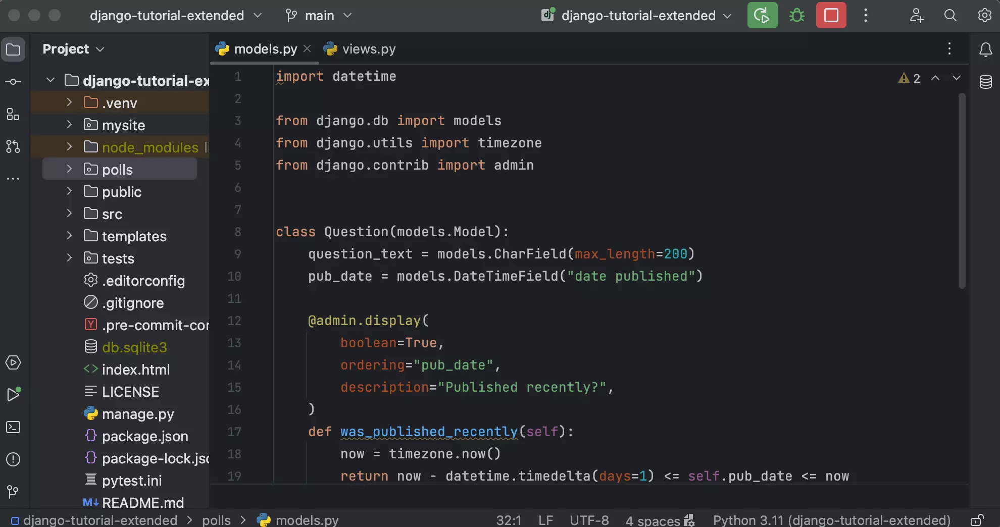
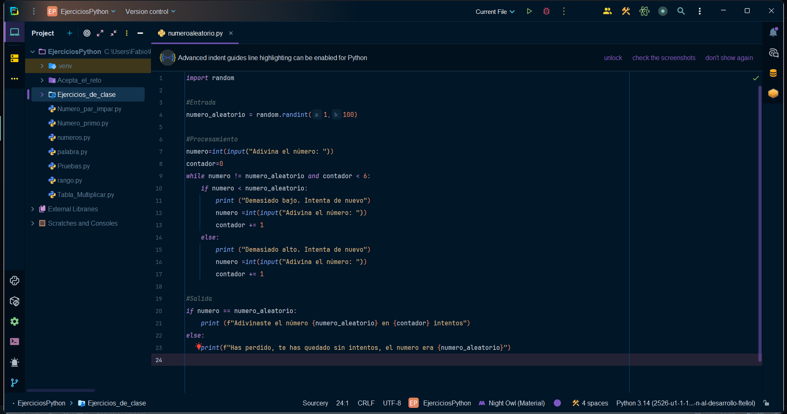
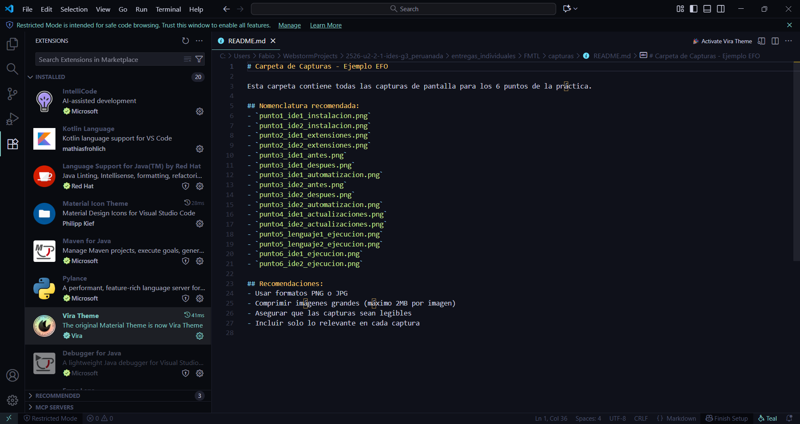
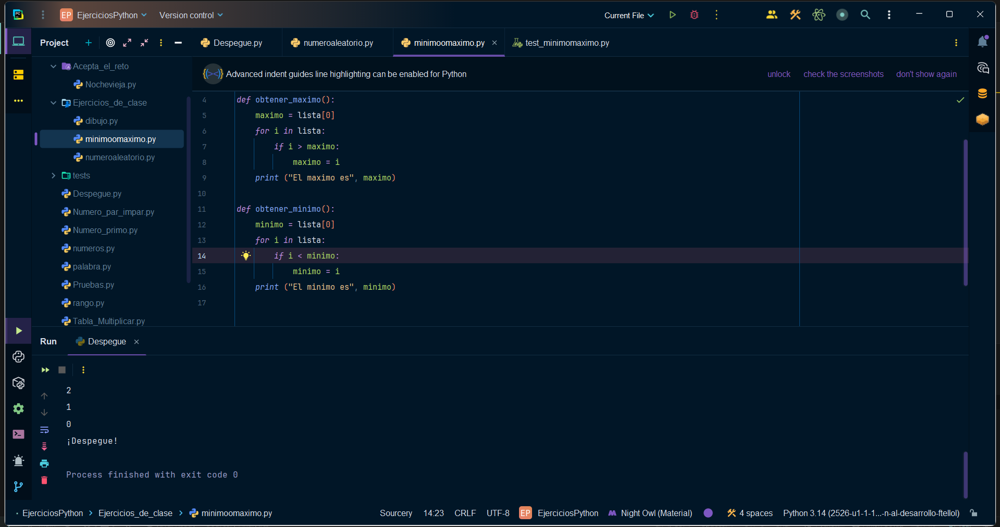
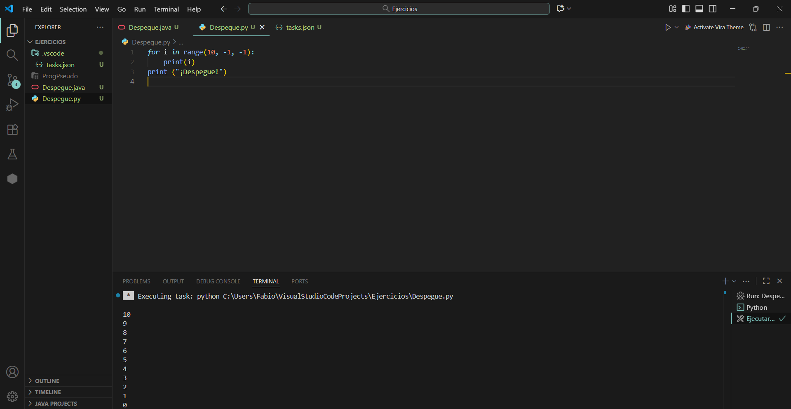

# Punto 3: Personalización y automatización del entorno

## IDEs utilizados
- **IDE 1:** Pycharm - Versión 21.0.8
- **IDE 2:** Visual Studio Code - Versión 1.105.1

## Descripción de la tarea
[Explica qué personalizaciones realizaste: tema, atajos de teclado, automatización de tareas]
He personalizado el tema con las extensiones anteriormente descargadas, además de modificar algunos atajos del teclado para que me sea más facil y en cada IDE automatizar una tarea distinta.
### Personalizaciones realizadas
- Tema:
    - En Pycharm, Night Owl (Material Theme) y iconos modificados (Atom Material Icon)
    - En VSCode, Vira Ocean High Contrast (Vira Theme) y iconos modificados (Material Icon Theme)
- Atajos de teclado: VSCode= Shift + F10 (Ejecutar terminal) y Ctrl + X (Cerrar archivo) y Pycharm= refactorizar con Shift + F6
- Automatización: Ejecutar el programa al guardar con un atajo y Automatización de tests

## Respuestas a preguntas evaluativas

### Pregunta 1: ¿Qué aspectos del entorno personalizaste y cómo mejoró tu experiencia de desarrollo?
En primer lugar, cambié el tema del IDE y los iconos para que la interfaz sea más clara y visualmente agradable, lo que facilita distinguir archivos, carpetas y secciones importantes del proyecto y personalmente me ayuda a programar mejor.

Además, modifiqué algunos atajos de teclado para adaptarlos a mi facilidad. Por ejemplo, en Visual Studio Code cambié el atajo para ejecutar la terminal a Shift + F10, lo que me permite abrir la terminal de manera rápida y cambié el atajo para cerrar archivos a Ctrl + X. Mientras que en Pycharm cambie el de refactorizar a Shift + F6.

### Pregunta 2: ¿Cómo configuraste la automatización de tareas y en qué te benefició durante el trabajo?
En Visual Studio Code configuré una tarea automática mediante el archivo tasks.json, la cual ejecuta mi programa Python con solo usar un atajo o al guardar el archivo. Esto me permitió ahorrar tiempo y comprobar rápidamente los resultados de mi código sin tener que escribir comandos manualmente en la terminal.

En PyCharm, aproveché la automatización de tests que el IDE ya trae predefinida. Configuré los tests con pytest para que se ejecuten fácilmente desde el entorno, lo que facilitó la detección de errores y mejoró la eficiencia al verificar que el código funcionara correctamente después de cada cambio.

## Evidencias
**ANTES:**

**DESPUÉS:**

**AUTOMATIZACIÓN:**

