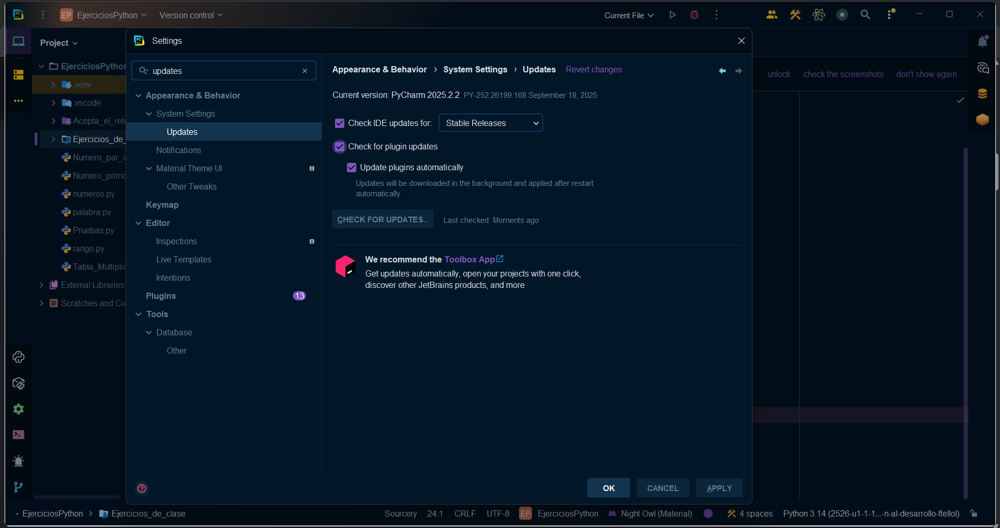
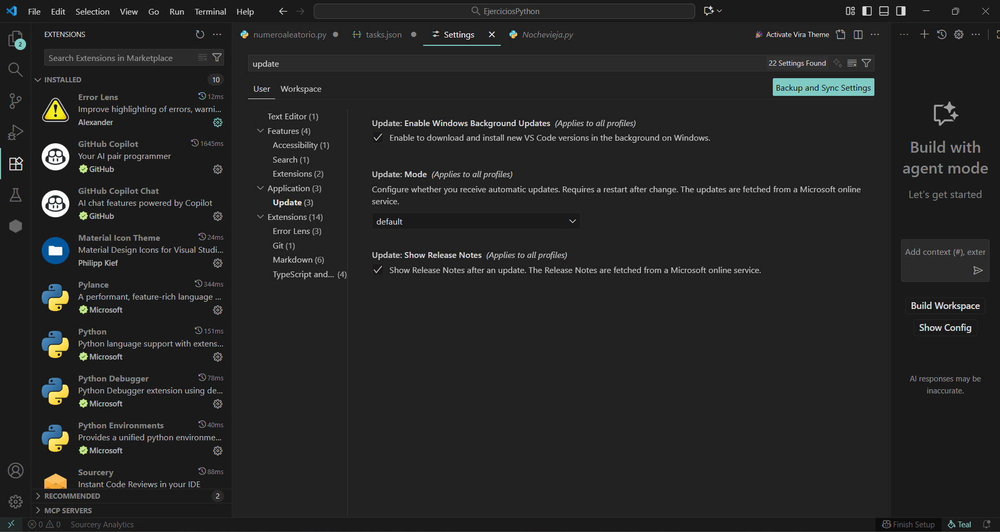
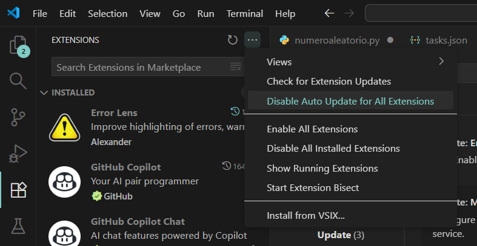

# Punto 4: Configuración del sistema de actualización del entorno de desarrollo

## IDEs utilizados
- **IDE 1:** Pycharm - Versión 21.0.8
- **IDE 2:** Visual Studio Code - Versión 1.105.1

## Descripción de la tarea
He configurado el sistema de actualizaciones automáticas en ambos IDEs para asegurar que siempre tenga la versión más reciente y estable de cada entorno de desarrollo.

## Respuestas a preguntas evaluativas

### Pregunta 1: ¿Cómo configuraste las actualizaciones automáticas en cada IDE?
- En PyCharm, accedí a Settings → System Settings → Updates y activé dos opciones:
  -   Que el IDE revise siempre si hay nuevas versiones disponibles y si encuentra que actualice automáticamente los plugins.
  -   Que me notifique siempre que exista una nueva actualización estable del IDE para poder instalarla.
- En Visual Studio Code, fui a Preferences → Settings → Update y dejé el modo de actualizaciones en su configuración predeterminada (default), que busca nuevas versiones automáticamente y las descarga. Además, desde la sección de Extensions, configuré que las extensiones se actualicen de manera automática.

### Pregunta 2: ¿Por qué es importante mantener el IDE actualizado en proyectos de desarrollo?
Mantener el IDE actualizado es fundamental porque las nuevas versiones incluyen mejoras de rendimiento, corrección de errores y funciones que facilitan la programación. No actualizar el entorno puede provocar incompatibilidades, pérdida de soporte o errores de ejecución, lo que afectaría directamente al desarrollo del proyecto y su estabilidad.

## Evidencias

