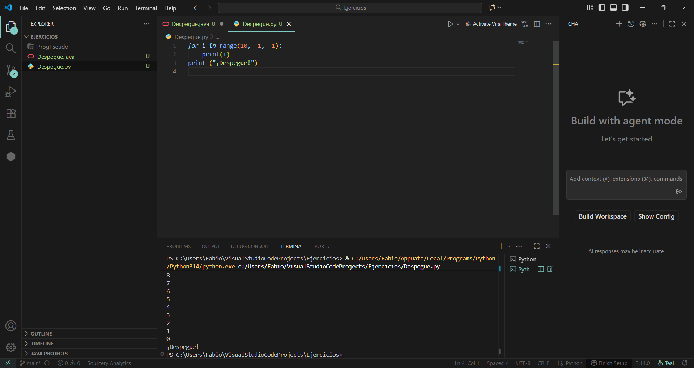
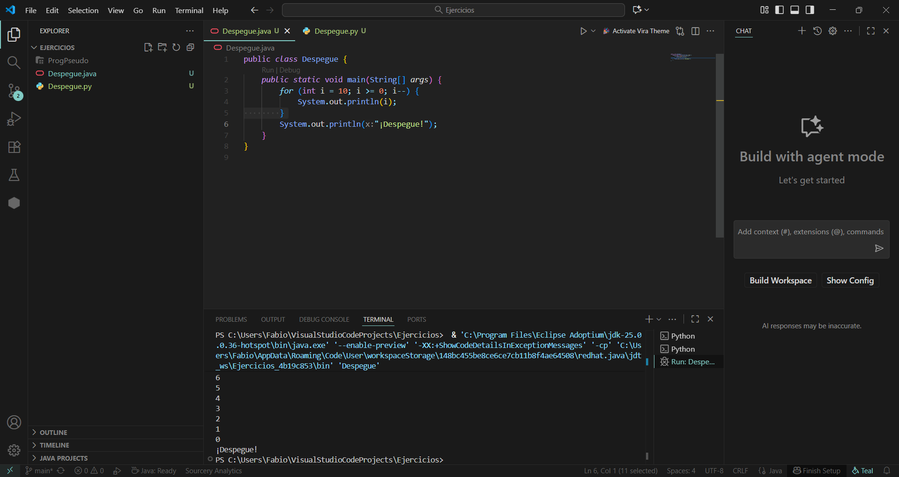

# Punto 5: Generación de ejecutables a partir de código fuente en distintos lenguajes en un mismo IDE

## IDE utilizado
- **IDE:** Visual Studio Code - Versión 1.105.1

## Descripción de la tarea
Programa "cuenta atrás" que cuenta de 10 a 0 y luego imprime "¡Despegue!"

### Lenguajes utilizados
- **Lenguaje 1:** Python
- **Lenguaje 2:** Java

## Código implementado

### Lenguaje 1: Python
```[Python]
for i in range(10, -1, -1):
    print(i)
print ("¡Despegue!")
```

### Lenguaje 2: Java
```[Java]
public class Despegue {
    public static void main(String[] args) {
        for (int i = 10; i >= 0; i--) {
            System.out.println(i);
        }
        System.out.println("¡Despegue!");
    }
}
```

## Respuestas a preguntas evaluativas

### Pregunta 1: ¿Cuál fue el proceso para ejecutar el mismo programa en diferentes lenguajes dentro del mismo IDE?
El IDE escogido fue Visual Studio Code. Para el programa en python necesitas tener python y la extensión Python mientras que en Java necesitas un JDK y la extensión de Java. En ambos lenguajes el proceso de ejecución es similar donde primero se configura el entorno (interprete para Python y JDK para java), luego escribir el código y por último la ejecución. La diferencia está en que Python se ejecuta directamente gracias al intérprete mientras que Java requiere compilación previa a bytecode.

### Pregunta 2: ¿Qué diferencias encontraste en la generación del ejecutable entre los dos lenguajes?
La principal diferencia en la generación del ejecutable entre Python y Java es que Python no genera un archivo ejecutable independiente, ya que se interpreta directamente con el intérprete, mientras que Java primero compila el código fuente a bytecode y luego se ejecuta en la JVM.

## Evidencias

