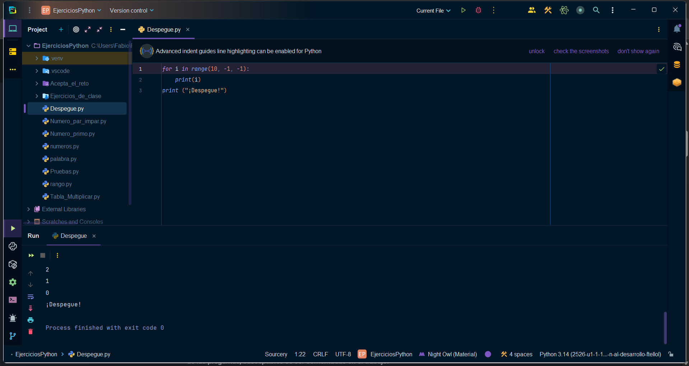
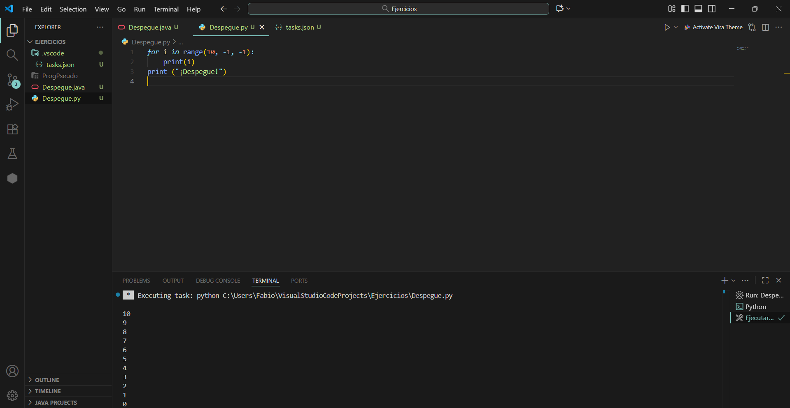

# Punto 6: Generación de ejecutables con diferentes IDEs a partir del mismo código fuente

## IDEs utilizados
- **IDE 1:** Pycharm - Versión 21.0.8
- **IDE 2:** Visual Studio Code - Versión 1.105.1

## Descripción de la tarea
Programa "cuenta atrás" en Python que cuenta de 10 a 0 y luego imprime "¡Despegue!"

## Código implementado

```python
# Código Python del programa cuenta atrás
for i in range(10, -1, -1):
    print(i)
print ("¡Despegue!")
```

## Respuestas a preguntas evaluativas

### Pregunta 1: ¿Qué diferencias encontraste al ejecutar el mismo código fuente en diferentes IDEs?
Al ejecutar el mismo programa en los dos IDEs no se nota diferencia en la ejecución del código, ambas lo ejecutan y lo muestran en la terminal. La principal diferencia está en lo visual, ya que cada IDE tiene su interfaz.

### Pregunta 2: ¿Cuál de los IDEs te pareció más cómodo o eficiente para ejecutar el código Python o el lenguaje que hayas elegido? ¿Por qué?
En cuanto a comodidad, aunque Visual Studio Code funciona muy bien para Python, Pycharm me resulta más eficiente, ya que es un IDE especializado en Python y ofrece herramientas integradas muy utiles como puede ser el autocompletado más avanzado, debugging, integración con testing. Además, al ser el IDE que más tiempo he usado, ya me he acostumbrado a su funcionamiento, lo que hace que la programación sea más rápida y fluida.

Pero al estar probando Visual Studio Code, considero que lo prefiero para programar en multilenguaje, ya que permite trabajar con distintos lenguajes dentro del mismo IDE de manera rápida y flexible. Su sistema de extensiones facilita agregar soporte para Python, Java, JavaScript, C++ y muchos otros, todo sin necesidad de cambiar de programa.

## Evidencias

