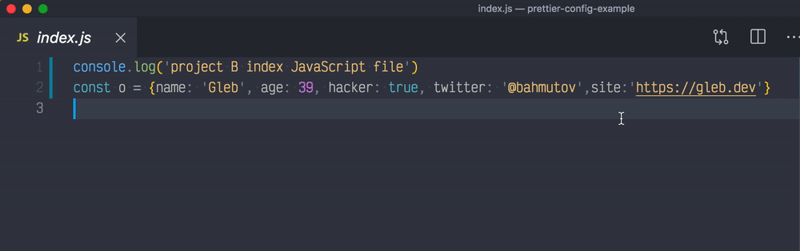
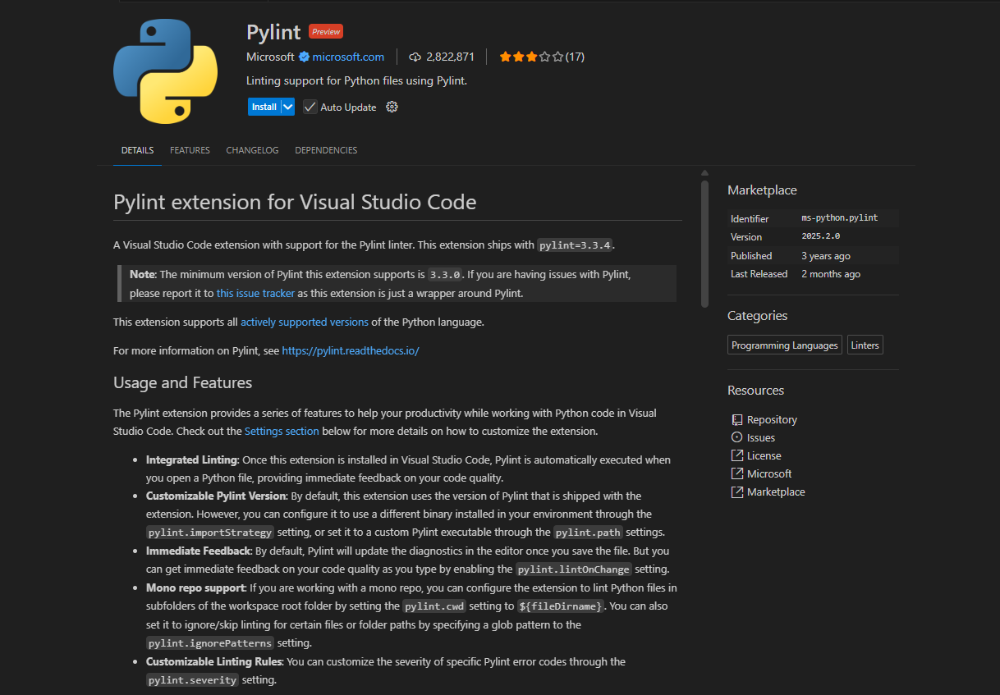
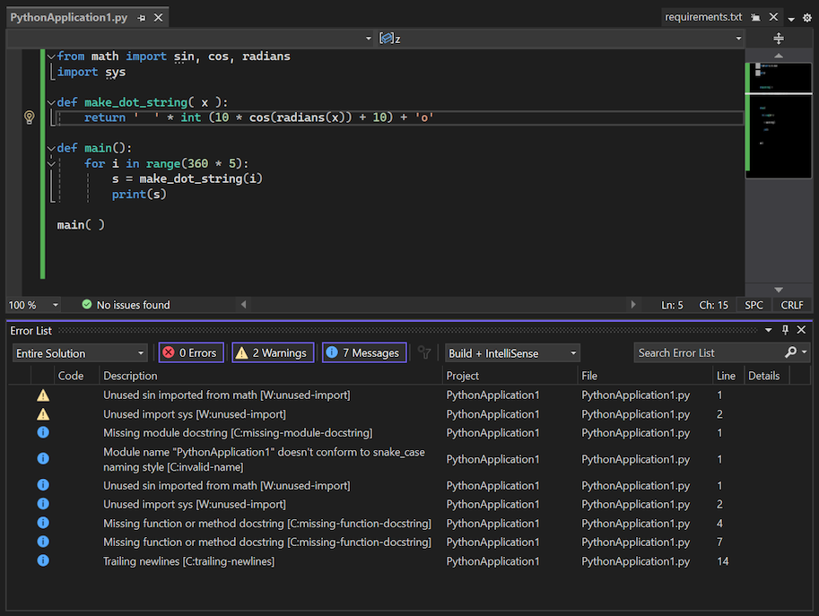
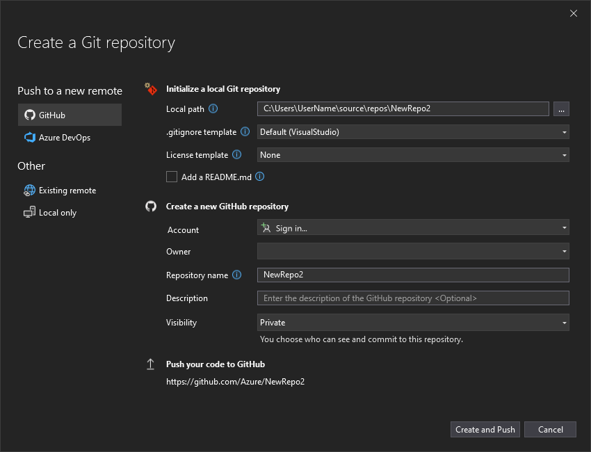

# Punto 2: Gestión de módulos y extensiones en el entorno de desarrollo

## Índice

- [Gestión de módulos y extensiones en el entorno de desarrollo (CE 2.b)](#punto-2-gestión-de-módulos-y-extensiones-en-el-entorno-de-desarrollo)
    - [Visual Studio Code](#visual-studio-code)
    - [IntelliJ IDEA](#intellij-idea)

### Visual Studio Code

En Visual Studio Code he decidido instalarme el plugin de Pylint.
La instalación del plugin **Pylint** ha aportado una mejora radical a como trabajo con Python puesto que me ayuda a detectar errores y problemas de estilo en tiempo real, lo que me permite anticipar y corregir fallos antes de ejecutar el código, resultando fundamental para garantizar la calidad, legibilidad y coherencia del proyecto desde el primer momento.

Además, gracias a la gestión intuitiva de extensiones, puedo añadir funcionalidades específicas según las necesidades del proyecto. Por ejemplo, combinando Pylint con otras extensiones como **Prettier** para formatear el código automáticamente, consiguiendo que el desarrollo en Visual Studio Code sea mucho más eficiente y profesional.

*Ejemplo formateo Prettier*

En definitiva, **Visual Studio Code destaca por la facilidad y rapidez para instalar cualquier plugin**, permitiendo personalizar el entorno según las necesidades concretas de cada proyecto y perfil de desarrollador.

El proceso de instalación en Visual Studio Code es muy sencillo, puesto que si accedemos al apartado de Extensiones (Plugins) desde la barra lateral nos redirigirá automáticamente al apartado en donde podemos descargarnos las extensiones deseadas, como se muestra a continuación:

 

Una vez en el apartado de extensiones procedemos a buscar la extensión según nuestros intereses, en este caso he optado por Pylint como se mencióno anterormente.

*Ejemplo de funcionamiento*

Como podemos observar, esta extensión nos muestra advertencias y mensajes informativos que aunque no sean errores que corten el flujo del programa es de vital importancia solucionarlos para mayor profesionalidad.

### IntelliJ IDEA

En IntelliJ IDEA he decidido que la mejor extensión que me podía instalar es la que da soporte a Kotlin puesto que más adelante en el curso trabajaremos con este excelente lenguaje de programación sucedáneo del lenguaje orientado a objetos por excelencia Java.

En este caso, para proceder a la instalación de extensiones desde el propio IDE también es muy sencillo puesto que desde la pantalla de inicio en la barra lateral podemos observar una opción que nos redirige directamente al apartado de la instalación de los plugins o extensiones, como se observa a continuación:

Una vez dentro, buscamos la extensión de nuestra preferencia, en este caso Kotlin, la cual nos aporta un soporte avanzado para el lenguaje, facilitándonos el desarrollo de software.

La instalación del **plugin de Kotlin** transforma IntelliJ IDEA en un entorno robusto y preparado para el desarrollo con este lenguaje. El soporte avanzado incluye autocompletado inteligente, refactorización guiada, integración con sistemas de dependencias y testeo simplificado. Esto facilita el desarrollo de aplicaciones modernas, acortando los tiempos de búsqueda, configuración y resolución de problemas durante la programación.

*Ejemplo integración de Git en IntelliJ IDEA*

IntelliJ IDEA sobresale, además, por la profundidad y calidad de sus plugins. Por ejemplo, al añadir **GitToolBox** consigo información de control de versiones directamente integrada en el editor, acelerando las tareas de colaboración y gestión de código fuente.

**Comparación final**
Instalar y utilizar extensiones es sencillo en ambos IDE, pero Visual Studio Code sobresale por la flexibilidad y rapidez para ampliar funcionalidades, mientras que IntelliJ IDEA destaca por la profundidad y calidad de los módulos que incorpora, ideal para proyectos avanzados y exigentes.