# Punto 3: Personalización y automatización del entorno

## Índice

- [Personalización y automatización del entorno (CE 2.c)](#punto-3-personalización-y-automatización-del-entorno)
    - [Visual Studio Code](#visual-studio-code)
    - [IntelliJ IDEA](#intellij-idea)

### Visual Studio Code

Para empezar, con el objetivo de reducir mi fatiga visual durante sesiones largas de trabajo me instalé la extensión One Dark Pro haciéndome más agradable la experiencia y mejorando mi concentración.

*Antes*

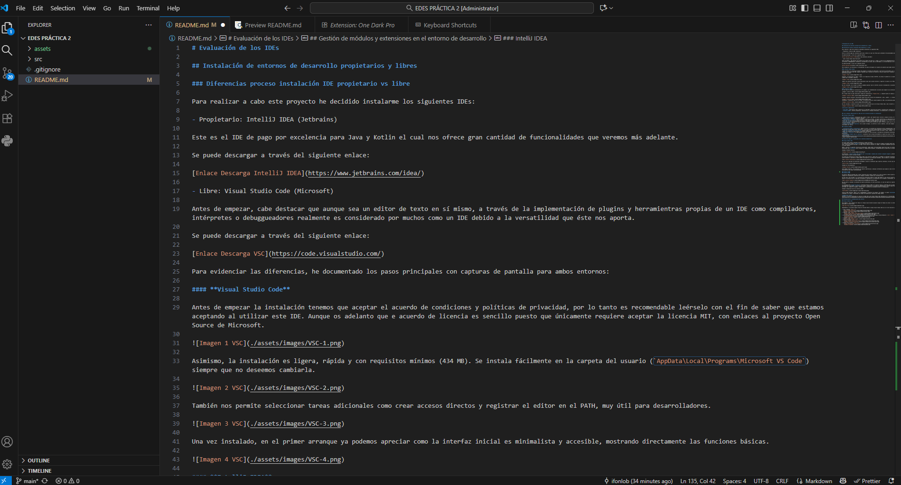

*Después*

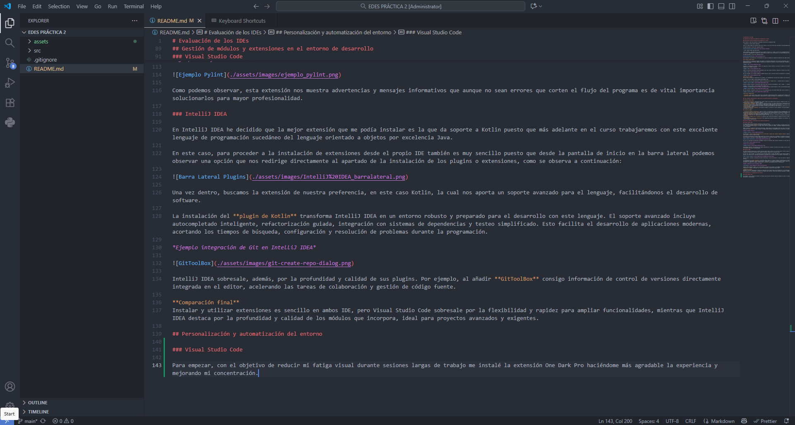 

Seguidamente, he ajustado algunos atajos de teclado desde el propio Visual Studio Code con el fin de facilitar y agilizar el trabajo. 

1. Abrir Terminal `(Ctrl + T)`
   
   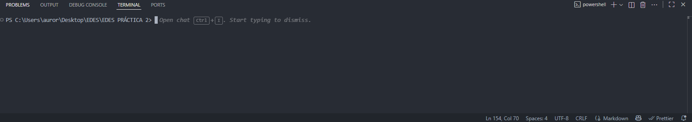
2. Duplicar línea `(Shift + ↓)` 
    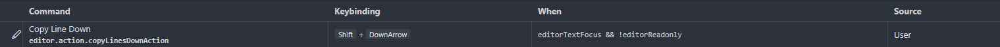
    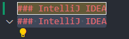
3. Ver previsualización de un archivo Markdown con la extensión de *Markdown Preview Enhancer* (`Ctrl + Shift + V`)
    
    *Imagen de ejemplo*
    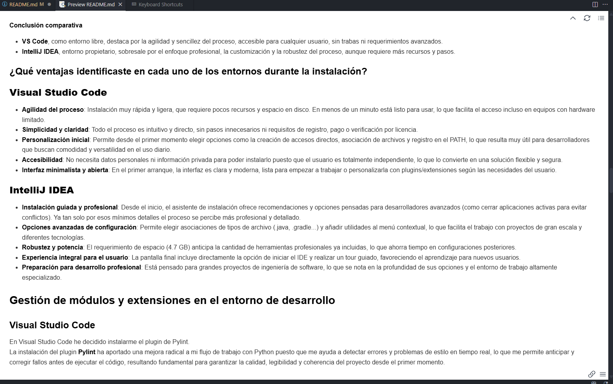
4. Eliminar Línea (`Ctrl + K`)
   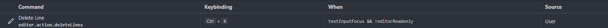
5. Edición Múltiple (`Ctrl + D`)
    
    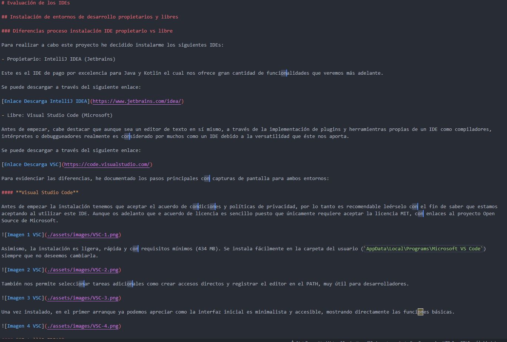
6. Buscar en un archivo (`Ctrl + Shift + F`)
    
    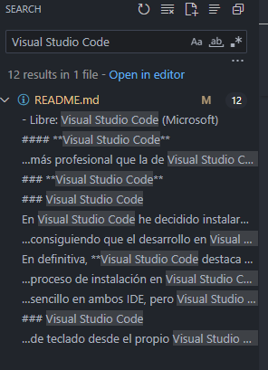

Gracias a la personalización avanzada del entorno, especialmente con la configuración de atajos de teclado para acciones críticas (como abrir terminal, duplicar línea, edición múltiple y previsualización Markdown), mi productividad ha mejorado notablemente. Puedo trabajar sin distracciones, minimizando el uso del ratón y automatizando tareas frecuentes. Al adaptar Visual Studio Code a mis necesidades reales de flujo de trabajo, reduzco errores, ahorro tiempo en tareas repetitivas y dedico mi energía a la lógica y creatividad en el desarrollo.

Respecto a la parte de automatización de tareas he configurado con la extensión **Code Runner** la compilación y ejecucción de mi código en cuestión de segundos a través del atajo de teclado (`Shift + Space`) como se muestra a continuación:

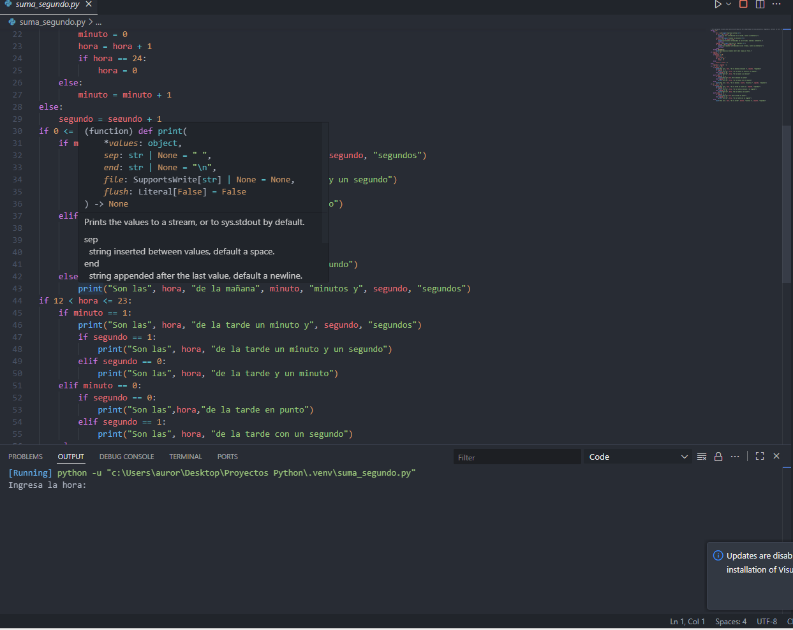

Por ejemplo, al implementar una función nueva, fui validando al instante cada modificación con un solo atajo, detectando errores inmediatamente y acelerando el ciclo de prueba y error.

### IntelliJ IDEA

Antes de empezar, cabe aclarar que he añadido los mismos atajos de teclado en IntelliJ IDEA permitiéndome una edición ágil (abrir terminal, duplicar línea, buscar, edición múltiple, etc.) sin importar el entorno en el que trabaje. Asimismo, he decidido centrar mi personalización en **el entorno visual y la organización del espacio de trabajo** para maximizar la comodidad y el enfoque:

- Personalicé el tema visual a *Darcula*, ajustando además el tamaño de fuente y los colores para los diferentes estilos de sintaxis y brackets, lo que me permite localizar errores y distinguir bloques de código con mayor facilidad.
*Antes*
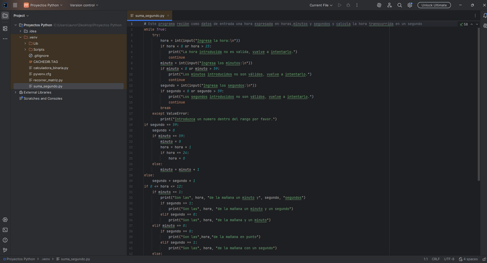
*Después*
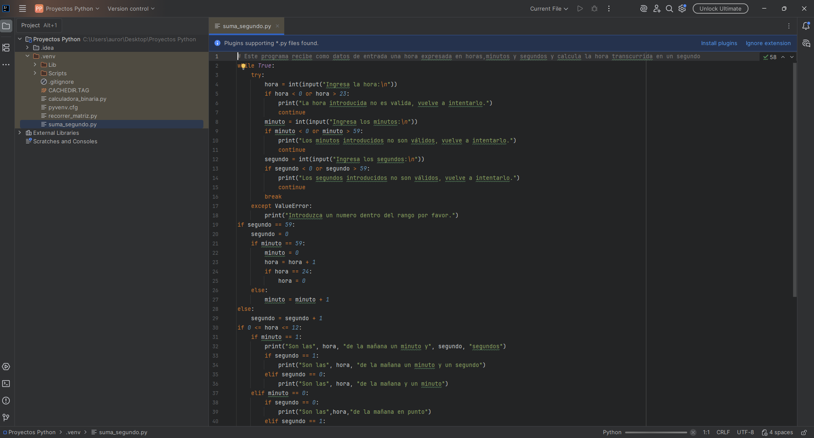

- También reorganicé los paneles laterales y la barra superior para que únicamente se muestren las herramientas más útiles para mi flujo de trabajo , eliminando distracciones y agilizando el acceso.

*Antes*

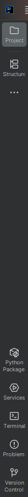

*Después*

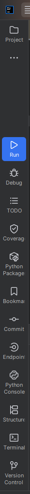

En cuanto a las automatizaciones, en IntelliJ IDEA he automatizado los test unitarios, es decir, ahora cada vez que quiera ejecutar los tests de mi proyecto solo tengo que utilizar el atajo de teclas `(Shift + F10)`

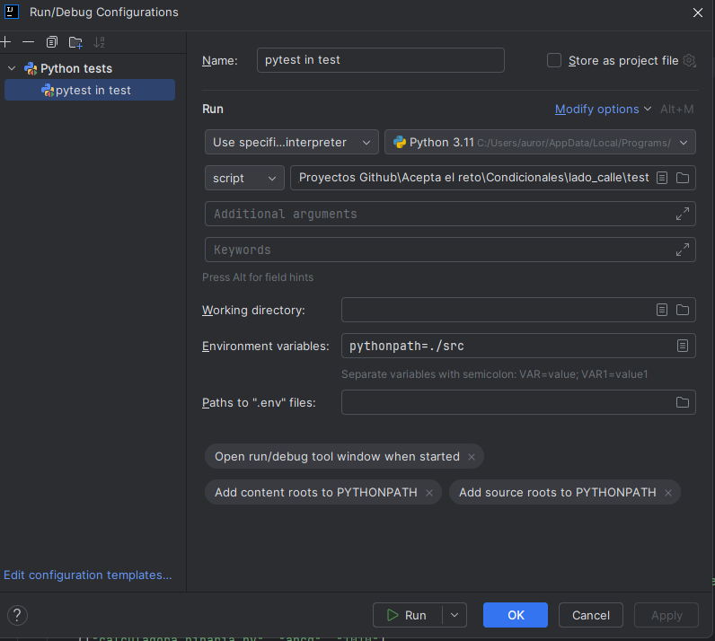

Gracias a esta personalización y automatización, puedo centrarme en la lógica y calidad de mi código, ya que tanto la ejecución de tests como la organización del entorno me permiten detectar errores de forma precoz, trabajar con mayor velocidad y minimizar distracciones innecesarias. Esta metodología resulta especialmente útil en proyectos de Python donde la validación continua y un entorno visual bien configurado marcan la diferencia entre la eficiencia y la frustración.
