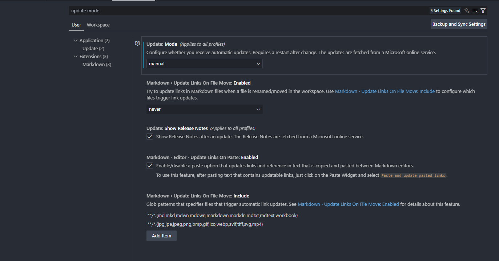
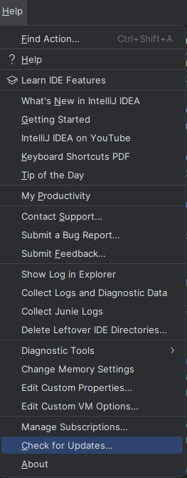
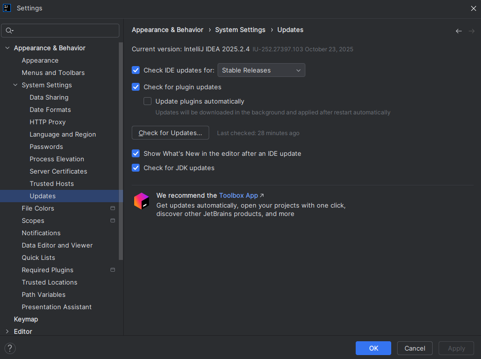

# Punto 4: Configuración del sistema de actualización del entorno de desarrollo

## Índice

- [Configuración del sistema de actualización del entorno de desarrollo (CE 2.d)](#punto-4-configuración-del-sistema-de-actualización-del-entorno-de-desarrollo)
    - [Visual Studio Code](#visual-studio-code)
    - [IntelliJ IDEA](#intellij-idea)
      - [¿Cómo configuré las actualizaciones automáticas?](#cómo-configuré-las-actualizaciones-automáticas)
      - [¿Por qúe es importante actualizar los IDEs en proyectos de desarrollo?](#por-qué-es-importante-mantener-el-ide-actualizado-en-proyectos-de-desarrollo)

### Visual Studio Code

Visual Studio Code está diseñado para mantenerse siempre actualizado de manera sencilla ya que por defecto, VS Code se actualiza automáticamente en la mayoría de sistemas operativos (Windows, macOS y muchas distros Linux), aun así, puedes comprobar y configurar este comportamiento pudiendo elegir modo manual o automático.

Aunque si quieres forzar la comprobación manual en cualquier momento puedes hacerlo desde `Ayuda > Buscar actualizaciones` en la barra superior.

No obstante, para poder configurar el comportamiento de las actualizaciones automáticas sigue estos pasos:
1. Ve a Archivo > Preferencias > Configuración.
2. Busca “update mode” o “actualizaciones”.
3. Puedes elegir entre los modos “default” (automático), “manual” o “none” (sin actualizaciones).

En Windows, por ejemplo, la opción suele estar en `Update: Mode` y desde mi punto de vista merece la pena dejarla en “default” para no perder nuevas funciones y parches de seguridad.

### IntelliJ IDEA

IntelliJ IDEA dispone de un sistema propio de actualizaciones automáticas y manuales que garantiza estar siempre al día con las últimas novedades, parches de seguridad y soporte para tecnologías recientes.

#### ¿Cómo configuré las actualizaciones automáticas?

Por defecto, IntelliJ IDEA te notifica cuando hay una nueva versión disponible y te da la opción de actualizar directamente desde la interfaz del programa.
Para gestionar el sistema de actualizaciones, sigue estos pasos:

1. Ve al menú superior **Help > Check for Updates...**
    - Desde ahí puedes comprobar y aplicar cualquier actualización manualmente cuando lo desees.
2. Para ajustar la frecuencia de comprobación y la política de actualizaciones:
    - Ve a **File > Settings > Appearance \ Behavior > System Settings > Updates**.

    

    - Puedes elegir entre “Stable updates”, “Beta updates”, o “EAP (Early Access Program)” para recibir novedades según tu preferencia de estabilidad.
    - Marca la opción para comprobar automáticamente y aplicar parches de seguridad si están disponibles.

    

#### ¿Por qué es importante mantener el IDE actualizado en proyectos de desarrollo?

- **Nuevas funcionalidades:** Las actualizaciones traen constantemente soporte para nuevas versiones de lenguajes, frameworks, plugins y mejoras de productividad.
- **Seguridad:** Cada versión corrige vulnerabilidades y errores críticos que podrían poner en riesgo tu código o tus datos.
- **Compatibilidad:** Los plugins y herramientas externas suelen requerir versiones recientes para funcionar correctamente y sacar el máximo partido al entorno.
- **Estabilidad:** no te sorprenderás tan fácilmente por bugs antiguos y mejorarás el rendimiento, logrando un entorno de desarrollo más fluido y fiable.