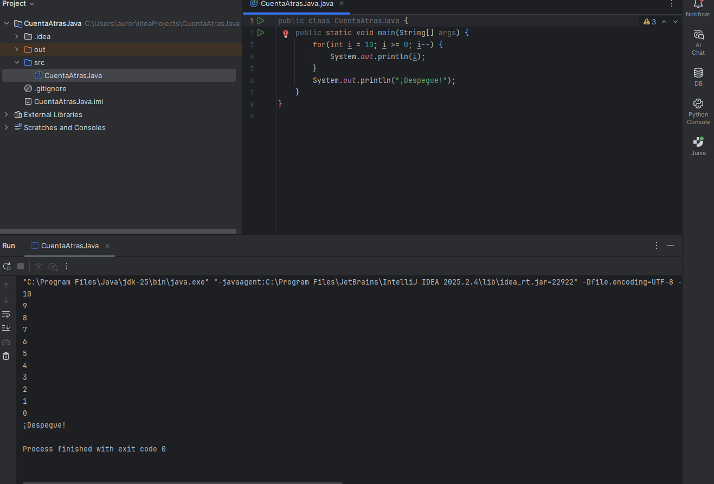
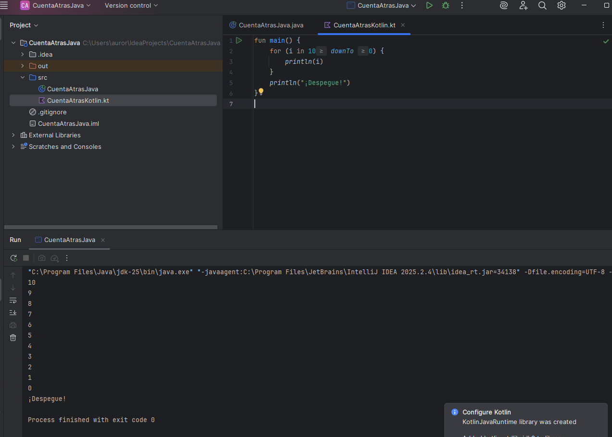

# Punto 5: Generación de ejecutables a partir de código fuente en distintos lenguajes en un mismo IDE

## Índice

- [Punto 5: Generación de ejecutables a partir de código fuente en distintos lenguajes en un mismo IDE](#punto-5-generación-de-ejecutables-a-partir-de-código-fuente-en-distintos-lenguajes-en-un-mismo-ide)
    - [1. Crea Proyecto Java/Kotlin correctamente](#1-crea-proyecto-javakotlin-correctamente)
    - [2. Crea los archivos fuente correctos](#2-crea-los-archivos-fuente-correctos)
    - [3. Ejecuta ambos programas](#3-ejecuta-ambos-programas)

### 1. Crea Proyecto Java/Kotlin correctamente

**Proyecto Java**

1. Ve a **File > New > Project…**
2. Selecciona **Java y Kotlin** en la lista, elige el SDK (Java 11 o superior recomendado) y pulsa **Next**.
3. Dale un nombre al proyecto, por ejemplo `DespegueJavaKotlin`.
4. Pulsa **Finish**.

Si al crear el proyecto seleccionaste Java y Kotlin juntos, ya tendrás soporte mixto.

### 2. Crea los archivos fuente correctos

A. **Archivo Java**

- Haz clic derecho en la carpeta `src` > **New > Java Class**.
- Nómbralo, por ejemplo, `CuentaAtrasJava`.

Pon este código:

```java
public class CuentaAtrasJava {
    public static void main(String[] args) {
        for (int i = 10; i >= 0; i--) {
            System.out.println(i);
        }
        System.out.println("¡Despegue!");
    }
}
```



B. **Archivo Kotlin**

- Haz clic derecho en la carpeta `src` o `src/kotlin` > **New > Kotlin File/Class**.
- Ponle nombre, por ejemplo, `CuentaAtrasKotlin`.

Pon este código:

```kotlin
fun main() {
    for (i in 10 downTo 0) {
        println(i)
    }
    println("¡Despegue!")
}
```



### 3. Ejecuta ambos programas

- Selecciona el archivo Java y pulsa el **triángulo verde** (o `Shift+F10`).
- Haz lo mismo con el archivo Kotlin.
- Verás en la consola la cuenta atrás de 10 a 0 y el mensaje “¡Despegue!” en ambos casos.

Si resumimos, el proceso en IntelliJ IDEA fue muy sencillo puesto que tan solo tuve que crear dos archivos fuente, uno en Java y otro en Kotlin, ambos en el mismo proyecto y carpeta src. Gracias al soporte nativo del IDE para ambos lenguajes, solo tuve que escribir el código y lanzar la ejecución con el botón de “Run”. El IDE se encargó automáticamente de compilar y ejecutar cada uno en la JVM, mostrando el resultado de ambos en la consola.

De la misma forma, en ambos lenguajes el archivo ejecutable generado es código bytecode `.class` para la JVM, por lo que el proceso técnico es idéntico, aunque, cabe destacar que al ser la sintaxis de Kotlin más sencilla, el archivo fuente se crea más rápido en este lenguaje.