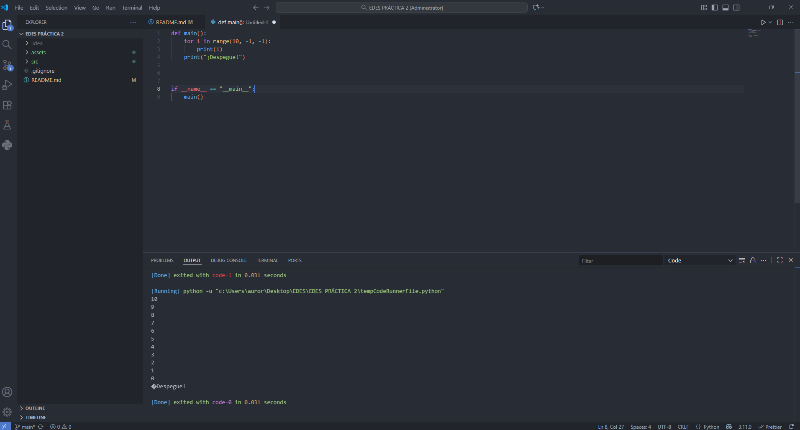
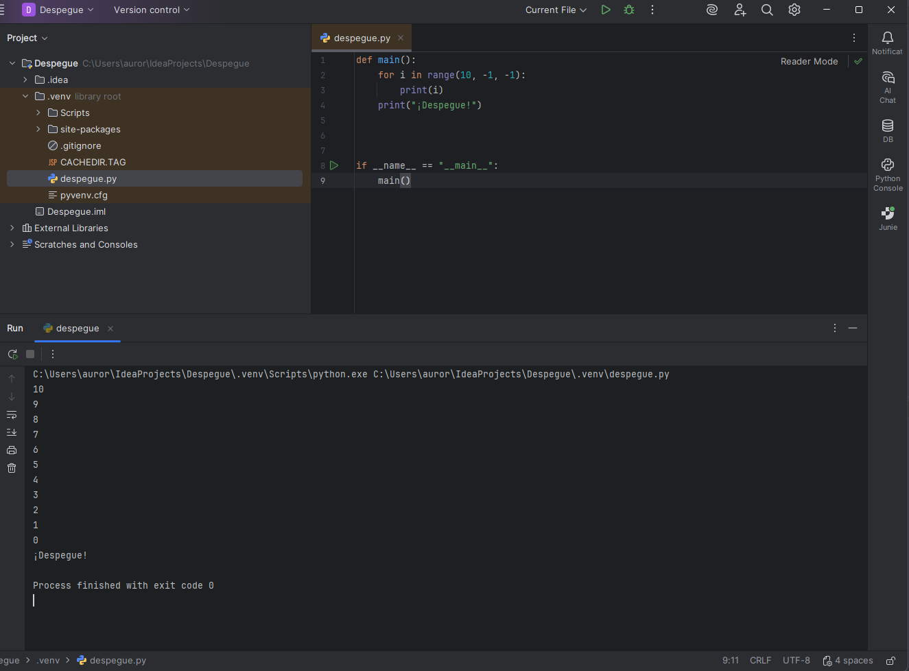

# Punto 6: Generación de ejecutables con diferentes IDEs a partir del mismo código fuente

## Índice

- [Generación de ejecutables con diferentes IDEs a partir del mismo código fuente (CE 2.f)](#punto-6-generación-de-ejecutables-con-diferentes-ides-a-partir-del-mismo-código-fuente)
    - [Código fuente utilizado (Python)](#código-fuente-utilizado-python)
    - [Ejecución en Visual Studio Code](#ejecución-en-visual-studio-code)
    - [Ejecución en IntelliJ IDEA](#ejecución-en-intellij-idea)

### Código fuente utilizado (Python)

```python
for i in range(10, -1, -1):
    print(i)
print("¡Despegue!")
```

### Ejecución en Visual Studio Code

Para poder ejecutar el programa abrí el archivo `.py` en Visual Studio Code, con la extensión de Python instalada y configuré el intérprete puesto que gracias a la extensión **Code Runner** (o el icono propio de "Run Python File"), pude ejecutar el script con un solo clic o atajo de teclado (`Shift + Space` en mi caso).
Asimismo, la consola integrada de VSC mostró rápidamente la cuenta atrás y el mensaje “¡Despegue!”.
El proceso fue muy ágil, y la integración de la terminal y salida simplifica la detección de errores.



### Ejecución en IntelliJ IDEA

En IntelliJ IDEA, añadí soporte para Python desde los plugins y configuré el intérprete correspondiente para el proyecto (en mi caso el CPython 3.11).
De la misma forma, creé un archivo `.py` y lo ejecuté directamente con el botón de “Run” o el atajo (`Shift + F10`).
Tras eso, el IDE lanzó el script en una ventana propia de ejecución mostrando cada línea de la cuenta atrás y “¡Despegue!”.
La experiencia fue prácticamente igual de fluida que en VSC, pero con un enfoque más IDE tradicional, más opciones de debugging y control total sobre la ejecución.



En cuanto a cuál de los IDEs me resultó más cómodo o eficiente para ejecutar código Python, sinceramente Visual Studio Code me pareció la mejor opción para pruebas rápidas y desarrollo ágil puesto que es ligero, arranca en segundos y la integración de extensiones como Code Runner hace que puedas ejecutar scripts y ver resultados casi al instante, sin rodeos y con total flexibilidad para personalizar el entorno a tu gusto según avance el proyecto.

Por otro lado, IntelliJ IDEA me parece la elección ideal cuando el proyecto de Python es grande o necesita una gestión más profesional dado que ahí se nota la diferencia en herramientas avanzadas de refactorización, el depurador profesional, integración robusta con control de versiones y testeo, aunque es cierto que requiere invertir algo más de tiempo en la configuración inicial y en recursos. Si busco velocidad y sencillez, tiro de VSC; si voy a trabajar en algo serio, en equipo o con muchas dependencias y necesito control total, IntelliJ IDEA es mi opción.